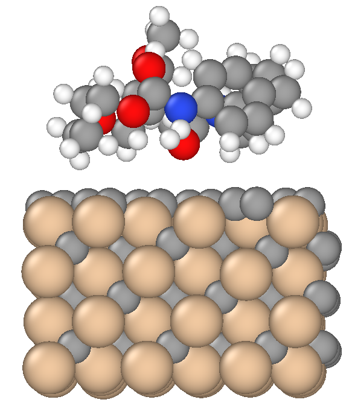

# DFT calculations of the silicon-carbide-polyurethane interface
The VASP input files required to conduct DFT calculations of the silicon-carbide-polyurethane interface (shown below) are provided. A movie of the ionic relaxation process is [available here](https://youtu.be/KTztlJ-vBDw).

